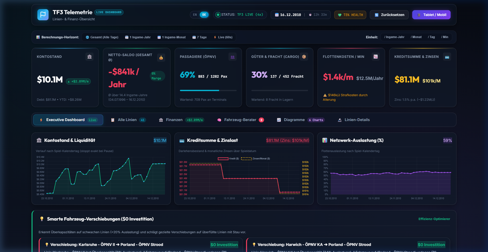
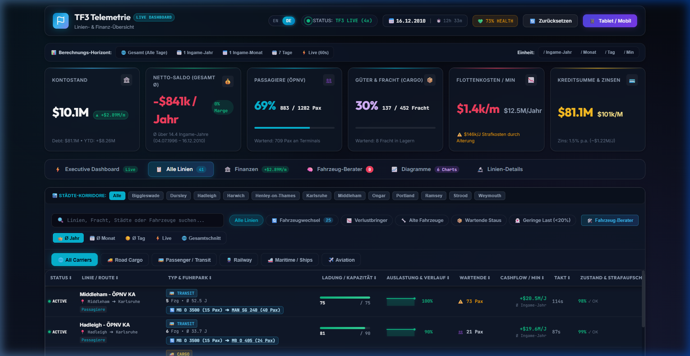
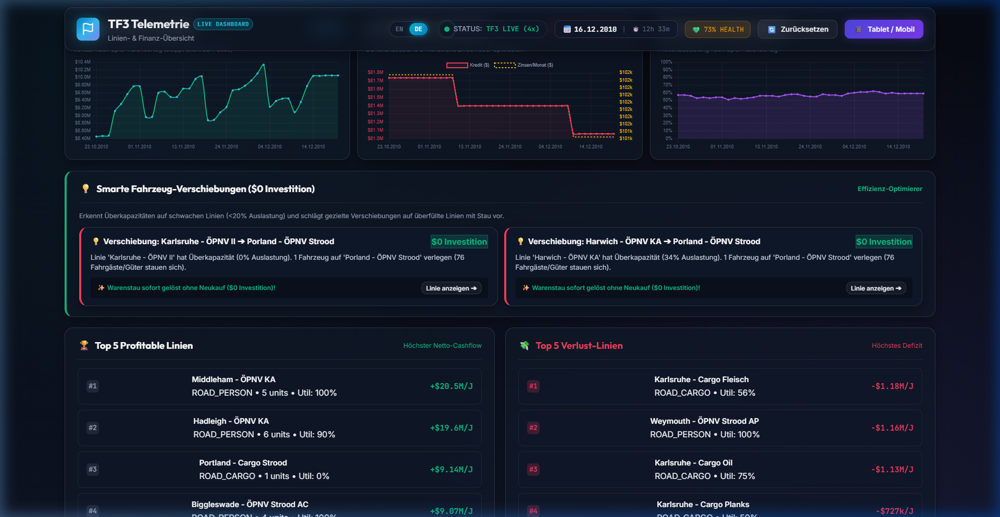

<div align="center">

# 🚅 Transport Fever 3 — Live Telemetry & Fleet Cockpit Suite

**Real-time telemetry, fleet operations monitoring, and financial analytics for Transport Fever 3 directly hooked into the C++ game engine.**

[](https://github.com/pono1012/TF3_Telemetry/releases/latest)
[](LICENSE)
[](https://www.transportfever2.com)
[](https://nodejs.org/)
[](https://www.python.org/)
[]()
[-brightgreen.svg)]()

<br/>


<p align="center">
  <b>Language:</b> 
  <a href="#-overview">🇬🇧 English (Primary)</a> • 
  <a href="#-deutsche-kurzanleitung">🇩🇪 Deutsch (German Guide)</a>
</p>

</div>

---

## 🌟 Overview

The **TF3 Telemetry & Fleet Cockpit Suite** is a modern, second-screen-capable live dashboard and analytics platform for **Transport Fever 3**. 
Powered by a native in-game engine hook, it extracts live vehicle positions, line loads, maintenance states, finances, and terminal backlogs without any perceptible game performance impact ($O(1)$ in-memory lookups, $<0.1\text{ ms}$ overhead).

Data can be monitored seamlessly on your desktop browser, an auxiliary display, or on an **iPad/tablet** via instant LAN QR-code pairing.

---

## 📸 Screenshots

<div align="center">

### 📊 Modern Live Cockpit (Executive Dashboard)
*Real-time KPIs, treasury balance, liquidity curves, network utilization, and smart vehicle rebalance recommendations.*



<br/>

### 📋 Comprehensive Line & Fleet Breakdown
*Filter by transit carrier (Rail, Road Cargo, Public Transit, Maritime, Aviation) with real-time capacity, intervals, and vehicle health.*



<br/>

### 📈 Financial & Predictive Trend Analytics
*3,600-tick historical treasury tracking, loan interest breakdown, cashflow velocity, and fleet utilization curves.*



</div>

---

## ⚡ Key Features

* **⚡ Native Game Engine Hook (Zero-Lag)**:
  * Minimal overhead through adaptive tick rates (5s during game pause/idle, 2s active gameplay) and cached $O(1)$ memory queries.
* **🌐 Web Cockpit & Second-Screen / Tablet Mode**:
  * Runs in any web browser at `http://localhost:3000`.
  * Built-in **LAN IP auto-detection & QR Code** for quick pairing on iPads, tablets, or phones.
* **🚚 5-Category Fleet Classification**:
  * 🚚 **Road Cargo & Trucks**
  * 🚌 **Public Transit & Buses / Trams**
  * 🚆 **Rail & Trains**
  * 🚢 **Maritime & Ships / Ferries**
  * ✈️ **Aviation & Aircraft**
* **🔧 Fleet Health, Aging & Penalty Costs**:
  * Real-time condition tracking from `0%` to `100%` (`getVehicleMaintenanceState`).
  * Calculates active running cost penalties (`+15%` to `+25%`) caused by poor maintenance.
  * Instant alerts when vehicles require immediate depot overhaul.
* **⚠️ Congestion, Bottleneck & Empty Run Detection**:
  * Automatic traffic jam detection (`0 km/h` on loaded vehicles along open track/road).
  * Station & terminal backlog tracking (waiting passengers and cargo heaps).
  * 100% empty-run warnings.
* **💡 Smart Rebalance Advisor ($0 Investment)**:
  * Analyzes lines with low utilization (< 20%) and recommends transferring surplus vehicles to overcrowded bottleneck lines.
* **💾 Persistent Historical Analytics**:
  * Stores up to 3,600 rolling historical ticks for treasury curves and financial runway projections.

---

## 📁 Repository Structure

```text
TF3_Telemetry/
├── companion-mod/              # Transport Fever 3 In-Game Mods
│   ├── tf3_telemetry/          # Native telemetry collector (C++ Engine Hook)
│   │   ├── _metadata/          # Mod icon (0.png) & modinfo.json
│   │   ├── content/            # In-game Lua scripts (telemetry.script.lua, ...)
│   │   ├── mod.json            # Mod manifest
│   │   └── README.md
│   └── auto_line_namer/        # Enhanced Auto-Line-Namer (City-first alphabetical grouping)
├── docs/                       # Documentation assets
│   └── screenshots/            # High-res screenshots & banners
├── public/                     # Web Cockpit frontend
│   ├── css/                    # Glassmorphism dark UI & responsive styles
│   ├── js/                     # Dashboard controller, WebSocket client & charts
│   └── index.html              # Cockpit single-page application
├── server.js                   # Node.js Express & WebSocket streaming server
├── start_cockpit.bat           # 1-Click launcher for the web dashboard
├── install_mod.bat             # 1-Click installer for the TF3 companion mod
├── create_telemetry_mod.py     # Automated mod deployer & engine-hook generator
├── live_monitor.py             # Optional Python SQLite logger & data-mining engine
├── debug_monitor.py            # Optional ANSI terminal live dashboard
├── validate_lua.py             # Lua syntax & token validator
├── package.json                # Node.js project manifest
├── LICENSE                     # MIT License
└── README.md                   # Primary project documentation
```

---

## 🚀 Installation & Quick Start

### Step 1: Install the In-Game Companion Mod

Choose **one** of the following two options:

#### Option A — Automatic 1-Click Installer (Recommended)
Double-click [`install_mod.bat`](install_mod.bat) (or run `python create_telemetry_mod.py`).
> *The installer automatically detects common Transport Fever 3 game directories across Steam and standalone installations, deploying the mod files directly.*

#### Option B — Manual Drag & Drop
Copy the folder [`companion-mod/tf3_telemetry`](companion-mod/tf3_telemetry) into your Transport Fever 3 `mods` directory:
* **Steam:** `Steam/steamapps/common/Transport Fever 3/mods/tf3_telemetry`
* **Standalone / Release:** `<GameDirectory>/Transport Fever 3/mods/release/tf3_telemetry`

*In-Game:* Load your savegame, open the mod settings dialog, enable **"TF3 Live Telemetrie & Cockpit"**, and launch your game.

---

### Step 2: Start the Web Cockpit Dashboard

1. **Prerequisite:** [Node.js](https://nodejs.org/) (Version 18 or newer) installed.
2. Double-click [`start_cockpit.bat`](start_cockpit.bat).
   * *Or start manually via terminal:*
     ```bash
     npm install
     npm start
     ```
3. Your browser will automatically open:
   ```text
   http://localhost:3000
   ```
4. **Tablet / Second-Screen Mode:** Click the **"Tablet / Mobil"** button in the top navigation bar and scan the displayed QR code with your iPad or mobile device connected to the same local Wi-Fi.

---

### Step 3 (Optional): Terminal Monitors

If you prefer inspecting telemetry in the Windows Terminal / PowerShell:

```powershell
# Live terminal monitor with colored ANSI tables
python debug_monitor.py

# Data-mining engine with persistent SQLite storage
python live_monitor.py
```

---

## ⚙️ Configuration & Environment Variables

The dashboard works out-of-the-box with automatic discovery. For custom installations, the following environment variables can be set:

| Variable | Description | Default |
| :--- | :--- | :--- |
| `PORT` | Web server listening port | `3000` |
| `TF3_STDOUT_PATH` | Explicit path to the game engine's `stdout.txt` | *Auto-detected (GSE Saves / Steam / Documents)* |
| `TF3_MOD_DIR` | Explicit mod target path for `create_telemetry_mod.py` | *Auto-detected* |

---

## 📦 Companion Mods & Attribution

* **`tf3_telemetry`** *(Original)*:
  * In-game engine hook and telemetry streamer for Transport Fever 3.
  * Developed by **pono1012**.
  * License: [MIT](LICENSE).

* **`auto_line_namer`** *(Fork / Adaptation)*:
  * Based on the original mod for Transport Fever 3 by **Dave W (BeautifulCheez)** (mod.io ID `6414403`), which originated from the TF2 mod by **Erkan Ercan**.
  * **Enhancement:** Town names are prepended to line names (`{townNames} - ...`), allowing alphabetical sorting in the game's Line Manager to cluster all lines belonging to the same city together.
  * License: MIT License (see [`companion-mod/auto_line_namer/LICENSE`](companion-mod/auto_line_namer/LICENSE)).

---

<br/>

<div id="-deutsche-kurzanleitung">

## 🇩🇪 Deutsche Kurzanleitung

### Was ist die TF3 Telemetrie Suite?
Ein modernes Live-Dashboard für Transport Fever 3, das Fahrzeug-, Linien-, Wartungs- und Finanzdaten in Echtzeit ohne Performance-Verlust aus dem Spiel ausliest und im Browser oder auf dem Tablet visualisiert.

### Schnellstart in 2 Schritten:
1. **Mod installieren:** Doppelklick auf [`install_mod.bat`](install_mod.bat) oder den Ordner [`companion-mod/tf3_telemetry`](companion-mod/tf3_telemetry) in dein Transport Fever 3 `mods/`-Verzeichnis kopieren. Im Spielstand aktivieren.
2. **Dashboard starten:** Doppelklick auf [`start_cockpit.bat`](start_cockpit.bat). Das Dashboard öffnet sich auf `http://localhost:3000`.
3. **Tablet / Handy:** Oben rechts auf **"Tablet / Mobil"** klicken und den QR-Code mit der Handykamera scannen (im selben WLAN).

</div>

---

## 🤝 Contributing & License

Contributions, issues, and feature requests are very welcome! Feel free to open an [Issue](https://github.com/pono1012/TF3_Telemetry/issues) or submit a Pull Request.

This project is licensed under the **[MIT License](LICENSE)**.
